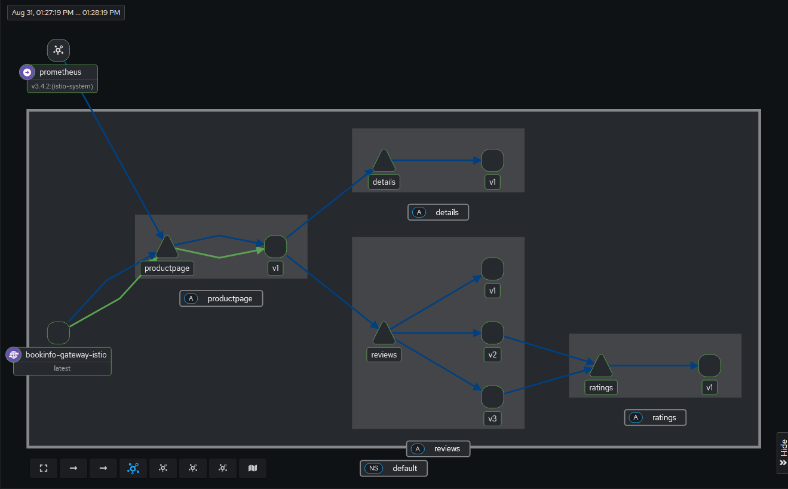

# Deploy Sample Bookinfo Application - Istio

This is the answer to exercise `5.2`.

## Visualizing the Application

This is the application visualized in Kiali.

## Enforcing Authorization Policies

- [`manifests/L4-auth-policy.yaml`](./manifests/L4-auth-policy.yaml) is the Layer 4 authorization policy allowing calls only from `cluster.local/ns/default/sa/bookinfo-gateway-istio` Service Account.
- [`manifests/L7-auth-policy.yaml`](./manifests/L7-auth-policy.yaml) handles all Layer 7 traffic using waypoint proxy.

## Managing Traffic

- [`manifests/httproute.yaml`](./manifests/httproute.yaml) configures traffic routing to send 90% of requests to `reviews` v1 and 10% to `reviews` v2.

See [`logs/manage-traffic.log`](./logs/manage-traffic.log) for the entire command + log.

## Clean Up

Done according to [Istio docs](https://istio.io/latest/docs/ambient/getting-started/cleanup/).
